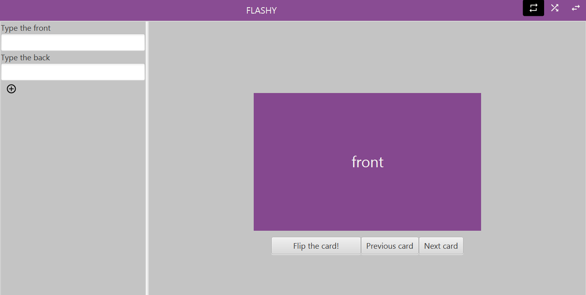

<!-- [![Pipeline status][badge-pipeline]][pipeline]
[![Code coverage][badge-coverage]][code-coverage]
[![Project page][badge-projectpage]][project-page]
[![Download][badge-download]][download]
[![Gitpod][badge-gitpod]][gitpod] -->

# Flashy

<div align="center">
  
</div>

## About

Flashy is an application which can help you make and memorize flashcards. It's meant to be used as a study tool, that keeps track of all your sets of flashcards.

A more in depth description of flashy's features can be found in the **old-link**

## Preview:

<div align="center">
  
</div>

### Architecture

#### Package diagram

<div align="center">
  
</div>

Link to Architecture.wsd is found here: [architecture](architecture.puml)

#### Sequence diagram

<div align="center">
  
</div>

Link to sequencediagram.wsd is found here: [sequencediagram](sequencediagram.puml)

#### Class diagram

<div align="center">
  
</div>

Link to classdiagram.wsd is found here: [classdiagram](classdiagram.puml)

## Usage

To use the application, you can download and run the jar file found in the **old-link**.

You can also use the **old-link** badge to download the latest version. Note that this might be unstable.

To run it, you're going to need do download **[Java][java-download]**.

---

## Usage

To use the application, you can open the jar file directly.

If you would rather want to open the application in remote mode, see [API](#rest-api)

### **Development requirements**

The easiest solution to get the development environment up and running, is to open the project in Gitpod.

If you want to work on it locally, you're going to need the following things:

- [A working installation of Maven 3][install-maven]
- [JDK 16 or higher][install-openjdk]

#### **Launch with JAR**

You can start the project by running either [`run.bat`](./run.bat) (windows), or [`run.sh`](./run.sh) (mac, linux, etc...). This will compile the application into a jar-file, which will end up in `target`, and then execute it. After running this script once, you will also be able to launch the jar-file directly in the file explorer, or by opening a terminal in the current directory and execute this command:

```bash
$ java -jar flashy/target/flashy.jar
```

#### **Launch Manually**

If you want to run the application manually without creating a jar file, open a terminal in the current directory, and execute the following commands:

```bash
$ mvn install -Dmaven.test.skip=true
$ cd fxui
$ mvn javafx:run
```

**Note:** Each time you update code outside of the `fxui` directory, you will need to move out to the current directory and run `mvn clean compile` before running `mvn javafx:run` inside `fxui` again.

---

## Modules

This project is split into modules. Each module is responsible for separate parts of the application.

| Module Name                   | Description                                                   |
| ----------------------------- | ------------------------------------------------------------- |
| [Core][module-core]           | The base classes and logic used everywhere in the application |
| [FXUI][module-fxui]           | The desktop application                                       |
| [REST][module-rest]           | The REST API server                                           |
| [Report][module-report]       | A special module used to generate code coverage reports       |
| [Packaging][module-packaging] | A special module used to package the code into a runnable JAR |

---

## REST API

This application also has a REST API, which makes it easy to extend the application to other platforms, like websites or phone apps.

To start the REST server, you can run

```bash
$ java -jar flashy/target/flashy.jar --server
```

or start it manually by executing

```bash
$ mvn install -Dmaven.test.skip=true
$ cd rest
$ mvn exec:java
```

Then you can start the app in remote mode by running

```bash
$ java -jar flashy/target/flashy.jar --remote
```

For more options, see

```bash
$ java -jar flashy/target/flashy.jar --help
```

[badge-pipeline]: https://gitlab.stud.idi.ntnu.no/it1901/groups-2021/gr2141/gr2141/badges/master/pipeline.svg
[badge-coverage]: https://gitlab.stud.idi.ntnu.no/it1901/groups-2021/gr2141/gr2141/badges/master/coverage.svg?
[badge-projectpage]: https://img.shields.io/badge/Docs-Project%20Page-blue
[badge-download]: https://img.shields.io/badge/Download-JAR-purple
[badge-gitpod]: https://img.shields.io/badge/Gitpod-Ready--to--Code-blue?logo=gitpod
[pipeline]: https://gitlab.stud.idi.ntnu.no/it1901/groups-2021/gr2141/gr2141/-/pipelines
[code-coverage]: https://it1901.pages.stud.idi.ntnu.no/groups-2021/gr2141/gr2141/jacoco-aggregate/index.html
[project-page]: https://it1901.pages.stud.idi.ntnu.no/groups-2021/gr2141/gr2141/index.html
[download]: https://it1901.pages.stud.idi.ntnu.no/groups-2021/gr2141/gr2141/flashy.jar
[gitpod]: https://gitpod.stud.ntnu.no/#https://gitlab.stud.idi.ntnu.no/it1901/groups-2021/gr2141/gr2141
[arc]: /flashy/architecture.wsd
[java-download]: https://www.java.com/en/download/
[latest-release]: https://gitlab.stud.idi.ntnu.no/it1901/groups-2021/gr2141/gr2141/-/releases
[install-maven]: https://maven.apache.org/download.cgi
[install-openjdk]: https://jdk.java.net/16/
[module-core]: ./core
[module-fxui]: ./fxui
[module-rest]: ./rest
[module-report]: ./report
[module-packaging]: ./packaging
