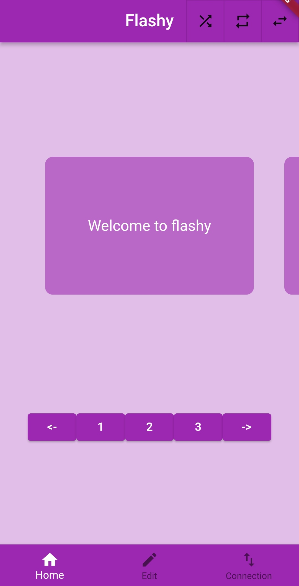
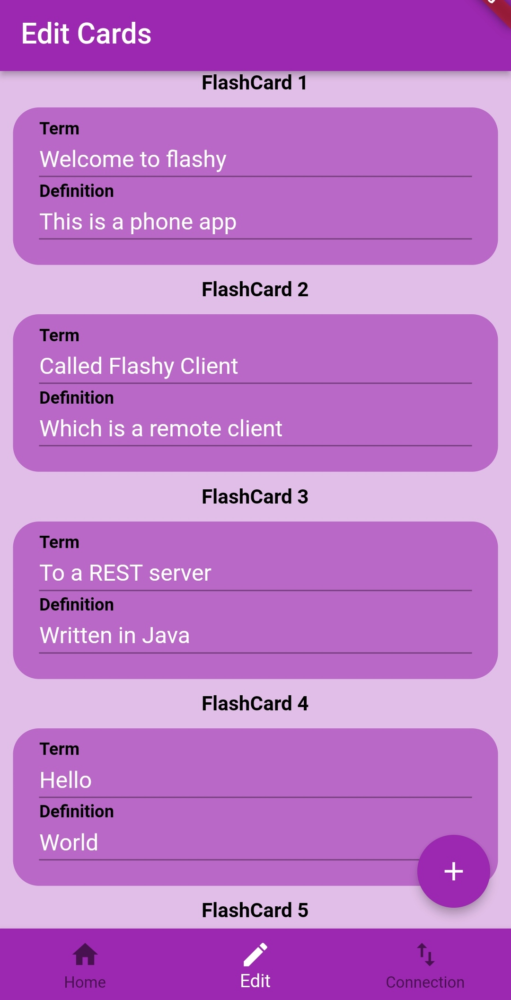
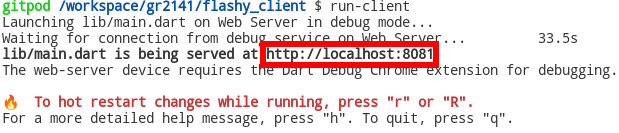

<!-- [![Client coverage][badge-client-coverage]][client-coverage]
[![Client page][badge-clientpage]][client-page]
[![Download APK][badge-download-apk]][download-apk] -->

# Flashy Client

A phone client for the Flashy program




This project was built with [Flutter][flutter]

## Getting Started

In order to launch this app, you will first need to [have flutter installed][flutter-installation].
This also includes the `Android SDK` and potentially a `Android Emulator` if you don't own an android phone.
These are usually installed through installing [Android Studio (Windows)][android-studio].

Although not tested, this app [might also work on IOS-devices][flutter-ios] provided you own a device running macOS.

After you have gotten your android device connected to `adb` (check by running `adb devices`), you can launch the application by executing:

```bash
$ flutter pub get
$ flutter run
```

### Running in Gitpod

Gitpod will automatically take care of installing the flutter framework and any dependencies.
However, gitpod does not properly support running android emulators at this point in time.
Therefore, the app will only be able to run in the web browser.

In order start the system, first switch to the terminal called `1: bash`, and execute the following commands

```bash
$ java -jar target/flashy.jar --server
```

Then switch over to the terminal called `2: flashy_client: bash`, and execute:

```bash
$ run-client
```

**Note:** it might take some time the second terminal to load. Just wait until you get a prompt

This will open a new tab in the browser. If if doesn't, you can manually open a new tab and go to the link in the terminal output to open the app.



Because this app was made for a phone layout, the website will look a little bit stretched.

## Usage

Start up a [flashy rest server][flashy-rest] on an ip and a port you know is accessible to the device running the client.
One of the easiest ways to do this if your network is locked down, might be to start a WiFi hotspot on your phone, and connecting the computer running the server to the hotspot. Then do the following:

- Open the app
- Go to the connection tab
- Fill in the IP (or hostname) and port of the server
- Click `reconnect`
- Switch back to the Memorize tab. You're now connected to the server!

### Debugging

#### **Could not <...>. Are you connected properly?**

- Have you typed the right ip and port into the app?
- Check if there's a firewall inbetween the app and the server
- The server might not have created the first default card deck properly. Try adding some cards in the second pane and see if the error resolves.

## Development tools

To lint the project, use the builtin vscode linting or execute:

```bash
$ flutter analyze .
```

To generate apidocs, execute:

```bash
$ flutter pub global activate dartdoc
$ dartdoc
```

To regenerate the splashscreen and/or app icon, execute:

```bash
$ flutter pub run flutter_launcher_icons:main
$ flutter pub run flutter_native_splash:create
```

<!-- [badge-client-coverage]: https://img.shields.io/badge/-client%20coverage-blueviolet
[badge-clientpage]: https://img.shields.io/badge/Docs-Client%20Page-blue
[badge-download-apk]: https://img.shields.io/badge/Download-APK-ff69b4
[badge-gitpod]: https://img.shields.io/badge/Gitpod-Ready--to--Code-blue?logo=gitpod -->

<!-- [client-page]: https://it1901.pages.stud.idi.ntnu.no/groups-2021/gr2141/gr2141/index.html
[client-coverage]: https://it1901.pages.stud.idi.ntnu.no/groups-2021/gr2141/gr2141/flashy-client/coverage/index.html
[download-apk]: https://it1901.pages.stud.idi.ntnu.no/groups-2021/gr2141/gr2141/flashy-client/flashy-client.apk
[gitpod]: https://gitpod.stud.ntnu.no/#https://gitlab.stud.idi.ntnu.no/it1901/groups-2021/gr2141/gr2141 -->

[flutter]: https://flutter.dev/docs
[flutter-installation]: https://docs.flutter.dev/get-started/install
[android-studio]: https://docs.flutter.dev/get-started/install/windows#android-setup
[flutter-ios]: https://docs.flutter.dev/deployment/ios
[flashy-rest]: ../flashy/README.md#rest-api
