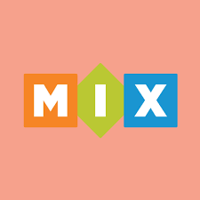

<!-- [![Pipeline status][badge-pipeline]][pipeline]
[![Documentation][badge-documentation]][documentation]
[![Finished Project][badge-finished-project]][finished-project] -->

# MovieMix

Dette er en nettside som lar deg se søke og filtrere etter 1000 filmer produsert i 2014 og 2015.
Nettsiden er basert på GRAND-Stacken.

<div align="center">
  
</div>

---

## Innhold

For å se koden til prosjektet klikk [her](moviemix).

---

## Ferdigstilt Prosjekt

<!-- For å se det ferdigstilte prosjektet klikk [her][finished-project] -->

For å se det ferdigstilte prosjektet klikk **old-link**.

---

## Testing

For å se testingen klikk [her](moviemix/src/__test__/).

---

## Dokumentasjon

Nettsiden Moviemix lar brukerne interagere med en filmdatabase som inneholder 1000 filmer.
Settet med filmer kan sorteres på popularitet og/eller rating, og brukeren kan filtrere
resultatsettet på en spesifikk filmsjanger. Brukeren kan også søke etter en viss film, og
bli presentert med et resultat. Det er mulig å se detaljer om hver av filmene, og gi en
anmeldelse av filmen som lagres på databaseserveren. De brukergenererte anmeldelsene
presenteres på en egen side, slik at brukeren kan se alle sine egne anmeldelser.

---

### Bærekraftig

For å gjøre nettsiden vår mer bærekraftig har vi tatt noen sentrale valg.

<ul>
  <li>
  Blant annet var det viktig at alle queries for filmer begrenset hvor 
  mange filmer som ble returnert hver gang. Vi har implementert en “infinite scrolling”
  som gjør at flere filmer bare lastes inn når man når bunnen av siden.
  </li>
  <li>
  Dette er i kombinasjon med bruk av ApolloClient sin cache, som den 
  alltid sjekker for data før den sender requests til databasen. På den 
  måten slipper vi å hente data unødvendig mange ganger.
  </li>
  <li>
  Siden har også basert seg på mørke farger, og vil til dels sørge for
  litt sparing av strøm. Hadde nettsiden vært designet for mobil bruk, ville det også 
  vært nyttig med en lys modus, for å bedre se sideelementene ute i dagslys.
  </li>
  <li>
  I stedet for å bruke masse plass på å lagre bilder i databasen, som
  generelt sett også er en dårlig praksis, har vi lagt inn lenker til filmplakatene i databasen.
  </li>
</ul>

---

### Universell Utforming

Aspekter ved universell utforming som er implementert gjelder blant annet bedre støtte for skjermlesere.

<ul>
  <li>
  Vi har for det meste prøvd å ha alternativ tekst på bilder, og beskrivende aria-labels
  på interaktive elementer på siden.
  </li>
  <li>En viktig del av universell utforming er at alt av interaktive knapper er store,
  og lette å sikte seg inn på. De fleste knappene våre oppfyller det bra, og er ikke unødvendig små.
  </li>
  <li>Kryssene for å lukke de modale vinduene våre kan være litt små, men til gjengjeld kan man også
  trykke overalt på skjermen for å lukke modalene. Nettsiden har også tatt hensyn til å ha stor nok 
  tekststørrelse slik at alt er lett å lese. Det er også godt mulig å zoome inn på siden.
  </li>
  <li>
  Vi tok i bruk chrome-extensionen 
  <a href="https://chrome.google.com/webstore/detail/colorblindly/floniaahmccleoclneebhhmnjgdfijgg">colorblindly</a> 
  for å se at sideelementene også var godt synlig med ulike former for fargeblindhet. Blant annet 
  har vi tatt til hensyn at hvit tekst på svart bakgrunn gir tydelig kontrast. I tillegg sjekket vi at det
  ikke var noen kritiske/alvorlige feil med UU-verktøyet <a href="https://www.deque.com/axe/devtools/">axe DevTools</a>.</li>

</ul>

### Tekniske krav, teknologier og -stack

Dette prosjektet er implementert i React med Typescript, og vi har valgt å bruke GRAND-stacken.

<ul>
  <li>
  Databasen vår er satt opp i <a href="https://neo4j.com/">neo4j</a>, og for dette prosjektet har vi startet
  med å importere data om filmer fra en csv fil, som vi bruker som grunnlag for applikasjonen. 
  I tillegg har vi hentet bilde-url-er fra <a href="https://www.themoviedb.org/">tmdb</a>.
  </li>
  <li>
  I backend bruker vi <a href="https://www.apollographql.com/docs/apollo-server/getting-started/">Apollo Server</a> 
  <a href="https://neo4j.com/docs/graphql-manual/current/">bibliotek for graphql</a>.
  Apollo Server gjør det veldig lett å sette opp en backend som fungerer rett ut av boksen, mens ved å
  bruke neo4j sitt graphql bibliotek får vi definert mesteparten av nyttige queries og resolvers automatisk.
  </li>
  <li>
  I frontend bruker vi <a href="https://www.apollographql.com/docs/react">Apollo client for react</a>.
  Dette gir oss enkel mulighet til å kommunisere med backend via queries, og gir oss nøyaktig den dataen vi trenger.
  </li>
  <li>
  For state management kom vi fram til at det var naturlig å bruke Apollo client sin local state management,
  ettersom den ga oss mulighet til å definere variabler som vi kan akksessere overalt i komponenttreet.
  Videre gjør det at vi slipper å legge til enda flere avhengigheter i prosjektet.
  </li>
  <li>
  Vi bruker <a href="https://mui.com/">Material UI</a> for UI. Vi brukte det også i forrige prosjekt,
  og føler at den er enkel å bruke og har mange gode verktøy. Videre er det også nyttig å støtte seg på
  biblioteker man er kjent med når man også bruker mye tid på å lære nye ting. Vi har også valgt å ta i
  bruk inline styling. Inline styling bringer med seg positive og negative aspekter, men for vårt bruk passer det bra.
  </li>
  <li>
  Vi har flere komponenter i prosjektet våres. Det kan argumenteres for at vi kunne dratt ut enda mer i
  diverse tilfeller. Vi har valgt å ikke gjøre dette fordi det kan føre til for mye abstraksjon i prosjektet
  og kan bli vanskeligere å forstå.</li>
  <li>
  For å kunne ta nytte av data lagt inn av brukere, har vi valgt å legge til en "simulert" 
  brukerfunksjonalitet på   siden. Vi lagrer en bruker med brukerId i databasen, og lagrer 
  også den i localStorage, slik at en "bruker" kan se alle ratings brukeren har lagt inn. 
  </li>
</ul>

### Testing

I dette prosjektet har vi valgt å implementere tre ulike former for testing - enhetstesting, end-2-end
testing og snapshot testing.

End-2-end testen vår tester noen av de grunnleggende funksjonene på nettsiden vår. Blant annet prøver
den å bruke filtreringen og sorteringen på siden, og så legger den inn en review på en film, og sjekker
deretter at reviewen finnes. Til slutt blir også søkefunksjonen testa, ved at den legger inn et ganske
spesifikt søk, og sjekker at resultatet er relevant. Testen sjekker på spesifikke filmer, og det funker
siden vi bare har 1000 filmer i databasen, men ideelt sett kunne testen være mer generell.

E2E starter opp frontend før testen, og lukker den i etterkant. For å kjøre testen brukes følgende
kommandoer

```bash
$ cd moviemix
$ npm run test:e2e
```

Enhetstestene våre tester også litt av ulik grunnfunksjonalitet på appen, men mer på komponentnivå.
Blant annet bruker vi mocking for å simulere resultat på et søk, og sjekker at det fungerer. Det
blir også testet at komponenter for filmdetaljer og -anmeldelse blir fremvist med riktig data, og
at helper-text fremvises ved ugyldig input. Det blir også testet at de forskjellige knappene i
filter fungerer som tenkt og kaller de riktige funksjonene.

For å kjøre enhetstestene:

```bash
$ cd moviemix
$ npm test
```

For å oppdatere snapshot:

```bash
$ cd moviemix
$ npm run updateSnapshot
```

Dette er et stort prosjekt så vi har valgt å fokusere på å vise kunnskap i de ulike formene
for testing enn å ha veldig mange tester.

### Notater

Hvis vi hadde hatt mer tid er det noen punkter vi gjerne kunne tenkt å forbedre:

<ul>
  <li>
  Ta i bruk et mer relevant datasett og ta hensyn velge et datasett som tar hensyn til spesielle
  karakterer.
  </li>
  <li>
  Knappene, radio-knappene og modal er ikke optimal for mobil skjermstørrelse.
  </li>
  <li>
  At man ikke kan legge inn flere reviews på samme film. 
  </li>
  <li>
  Kunne slette en review.
  </li>
  <li>
  Skrevet enda mer tester.
  </li>
  <li>
  Legge til ToolTip ved hover over truncated tittel på hovedsiden. Dette funker i Safari,
  men oppdaget litt sent at det ikke fungerer i andre browsere.
  </li>
  <li>
  Gjort CI/CD mer optimal med tanke på kodedekning.
  </li>
  <li>
  Søkefunksjonen vår endte opp med å gi bra og relevante søkeresultat, men i noen tilfeller
  kunne den vært forbedret. F.eks. er ikke filmen “The Imitation Game” første resultatet etter
  søk. Her kunne vi sett litt mer på fuzzysearch. 
  </li>
  <li>
  Vi har foreløpig valgt å la brukeren få filtrere og sortere resultatsettet fra databasen på
  landing-page, men ikke resultatsettet fra søk. Selv om vi i denne omgang valgte å ikke
  komplisere resultatsettet med sortering/filtrering, kunne vi kanskje ha gitt brukeren disse
  valgene også her.
  </li>
</ul>

### Avsluttende

Etter konstruktiv kritikk fra forrige prosjekt har vi blitt flinkere til å markere commits opp
mot tilhørende utviklingsoppgave, og til å lage issues for alle utviklingsoppgaver. Arbeidsprosessen
har gått veldig fint og det har ikke oppstått noen problemer vi ikke klarte å løse sammen.

<!-- Badges -->

<!-- [badge-pipeline]: https://gitlab.stud.idi.ntnu.no/it2810-h22/Team-59/prosjekt-3/badges/main/pipeline.svg
[badge-documentation]: https://img.shields.io/badge/-dokumentasjon%20-informational
[badge-finished-project]: https://img.shields.io/badge/-Ferdigstilt%20Prosjekt-ff69b4 -->

<!-- Links -->

<!-- [pipeline]: https://gitlab.stud.idi.ntnu.no/it2810-h22/Team-59/prosjekt-3/-/pipelines
[documentation]: https://gitlab.stud.idi.ntnu.no/it2810-h22/Team-59/prosjekt-3/-/blob/main/README.md
[finished-project]: http://it2810-59.idi.ntnu.no/project3/ -->
