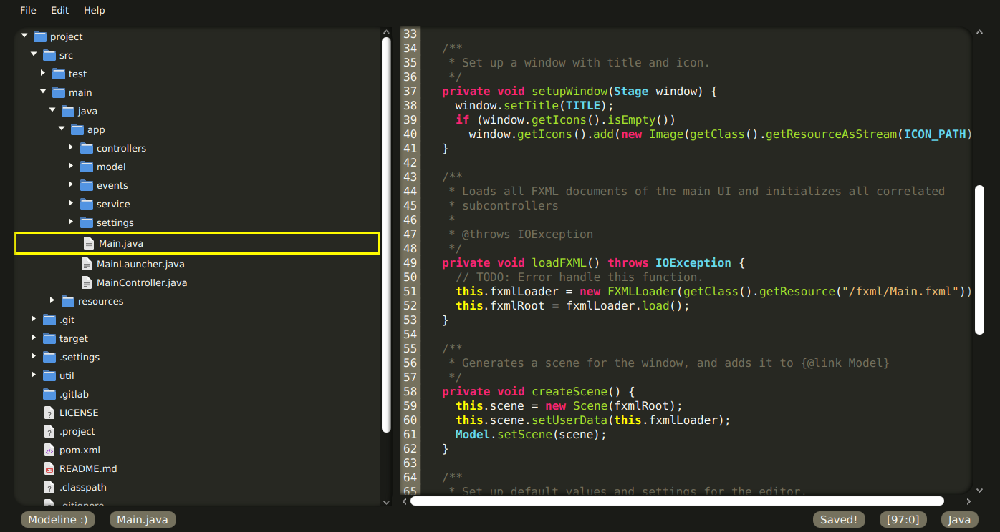

# Banana Editor

Probably tastes better than any Apple editor and NetBeans combined.

--> [See project requirement details here][requirements.md] <--

In order to run the program, use run.bat if using Windows or run.sh if using UNIX based OS

---

## Credits/Sources

- [james-d/SimpleMVP](https://github.com/james-d/SimpleMVP/tree/master/src/examples/mvp) -> Demonstration of JavaFX Model/View/Controller application
- [FXMisc/RichTextFX](https://github.com/FXMisc/RichTextFX) -> Library for handling rich text and line numbers
- [richtextfx-demos](https://github.com/FXMisc/RichTextFX/blob/master/richtextfx-demos/README.md) -> Examples and demos of how to use RichTextFX, including [Java Keywords Demo](https://github.com/FXMisc/RichTextFX/blob/master/richtextfx-demos/src/main/java/org/fxmisc/richtext/demo/JavaKeywordsAsyncDemo.java)
- [Pixabay/311788](https://pixabay.com/vectors/bananas-fruits-pair-yellow-bananas-311788/) -> Banana logo
- [Guava Event Bus](https://github.com/google/guava/wiki/EventBusExplained) -> Library for handling communication between controllers
- [JFX Moderna](https://github.com/openjdk/jfx/blob/master/modules/javafx.controls/src/main/resources/com/sun/javafx/scene/control/skin/modena/modena.css) -> CSS reference
<!---
- [devicons/devicon](https://github.com/devicons/devicon) -> Icon languages
  -->
- [Papirus](https://github.com/PapirusDevelopmentTeam/papirus-icon-theme) -> Icons for filetree
- [StackOverflow/38278601](https://stackoverflow.com/questions/38278601/javafx-treeview-directory-listing) ->
  Example of how to generate and show a filetree recursively.
- [Youtube/ProgrammingKnowledge](https://www.youtube.com/watch?v=RY_Rb2UVQKQ) -> Introduction to the fundamentals
  to create a filetree.
- [GenuineCoder](https://www.genuinecoder.com/save-files-javafx-filechooser/) -> Examples of how to use FileChooser
  and setting extensionfilters. Also included a nice method to save files.
- [Tutorialspoint](https://www.tutorialspoint.com/how-to-save-files-using-a-file-chooser-in-javafx) -> Example
  of how to use the openSaveDialog with FileChooser.
- [mkyoung](https://mkyong.com/java/how-to-create-directory-in-java/) -> Example of how to create a directory/folder.
- [Youtube/Cool IT Help](https://www.youtube.com/watch?v=gnXRI3pHxrU&t=727s) -> Showing how to cast (Stage). Example of how FXML, listener/event and DirectyChooser nicely can cooperate.
- [Code Makery](https://code.makery.ch/blog/javafx-dialogs-official/) -> Examples of many different javafx dialogs.
- [Oracle](https://docs.oracle.com/javase/tutorial/uiswing/components/dialog.html#button) -> How to use JOption.

[requirements.md]: https://gitlab.stud.idi.ntnu.no/oysteikt/h20-tdt4100-project/-/blob/master/REQUIREMENTS.md
