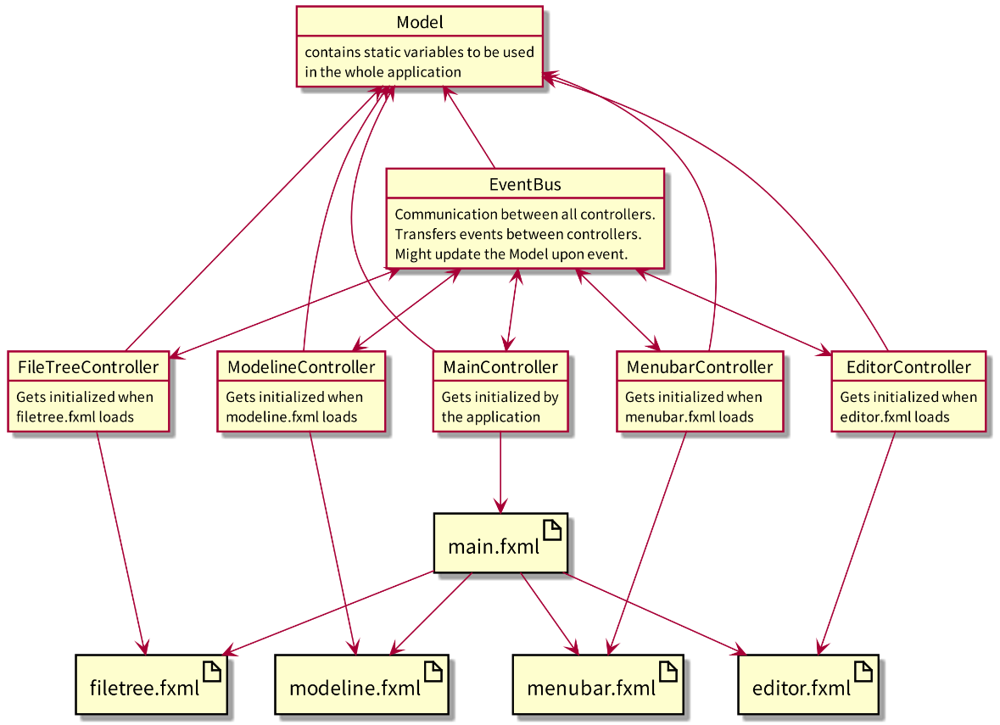

# Krav til applikasjonen

## Delbeskrivelser


### Del 1 - Grunnklasser og brukergrensesnitt

```
I denne delen skal dere lage de grunnleggende klassene i appen deres. Klassene skal realisere
hovedfunksjonaliteten i appen, men dere trenger ikke å implementere feilhåndtering og lagring i
denne delen (det kommer senere). Tilstanden til objektene i appen deres skal være innkapslet,
og et objekt skal administrere sin egen tilstand.
I tillegg til grunnklassene skal dere lage et brukergrensesnitt i FXML. Vi anbefaler at dere
tenker litt over dette grensesnittet, gjerne skissér det på forhånd for å se at det virker greit å
bruke. Om dere har tatt eller tar TDT4180 - Menneske-maskin-interaksjon kan det være lærerikt
å bruke noen av konseptene dere har lært der (men merk at dere ikke vurderes ut i fra det i dette
faget).

Dere skal også lage Controller- og App-klasser som starter appen og kobler sammen brukergrensesnitt 
og underliggende klasser. Merk at appen deres skal bygges etter Model-ViewController-prinsippet. 
Det betyr at det skal være et klart skille mellom modell (model), grensesnitt (view), og 
kontroller (controller) i appen. Her er grensesnittet definert av FXML-filene deres,
og modellene er de underliggende klassene. Kontrollerens jobb er å binde sammen grensesnitt og
modeller, altså å holde verdiene i grensesnittet oppdatert i forhold til modellene, og å reagere på
brukerinput i grensesnittet og kalle passende metoder i modellene.
```


### Del 2 - Filbehandling

```
Her skal dere utvide appen til å kunne lese fra og skrive til filer. Dere må selv bestemme hva som
skal lagres, og formatet det skal lagres på. Altså må dere finne en måte å strukturere tilstanden
i objektene deres som en tekstfil.

For å gjøre det enklere å bytte filformat på et senere tidspunkt, eller å gjøre det mulig å lagre
i forskjellige formater, skal dere lage et grensesnitt (interface) med metoder for lesing fra og
skriving til fil. Deretter må dere lage minimum en ny klasse (altså ikke en av klassene dere har
lagd tidligere i prosjektet) som implementerer grensesnittet og realiserer funksjonaliteten.
```


### Del 3 - Feilhåndtering

```
I de aller fleste programmer vil det være mulighet for at feil skjer under kjøring, uavhengig av
om koden er skrevet riktig. Det kan f.eks. være ved ugyldig input fra brukere, filer som ikke
eksisterer, manglende internett, eller lignende. Om denne type feil ikke håndteres, vil det enten
føre til at appen oppfører seg feil, eller at den krasjer.

I denne delen av prosjektet skal dere utvide appen deres til å håndtere feil på passende måter.
For å gjøre dette må dere finne ut:

• Hvor i appen deres det kan oppstå feil.
• Hvordan appen bør respondere på slik feil.

Deretter må dere implementere feilhånderingen dere har funnet ut at er hensiktsmessig.
```

### Del 4 - Testing

```
Siste del av prosjektet handler om å skrive enhetstester til appen deres. Dere bør teste alle
metoder med funksjonalitet utover helt enkle get- og set-metoder. Dere trenger heller ikke å
teste Controller- og App-klassene deres, da det ikke skal være logikk i disse. Har dere logikk
liggende i Controller-klassen bør dere flytte dette til en passende underliggende klasse før dere
begynner på denne delen.

Når dere skriver testene bør dere først tenke over hvilke deler av koden det er viktig å sjekke
at fungerer som den skal. Deretter bør dere prøve å komme på (kombinasjoner av) input-verdier
og tilstander som kan føre til uventet oppførsel i disse delene. Slike edge-cases bør det skrives
tester for, i tillegg til å teste for at funksjonaliteten fungerer med ”snillere” verdier. Til slutt er
det viktig at testene skal sjekke at koden fungerer, ikke motsatt. Om dere er sikre på at en testen
er riktig, men den feiler, så må dere sannsynligvis endre koden i klassen som testes – ikke testen
deres.
```

## Detaljerte krav

### Del 1 - Grunnklasser og brukergrensesnitt

1. **Appen skal bestå av minimum to interagerende klasser, i tillegg til Controller- og Appklassene, og brukergrensesnittet laget i FXML.**

Andre klasser:
  - [service/][service-folder]
  - [model/][model-folder]

App-klasse:
  - [Main.java][Main-file]

Controller klasser:
  - [MainController.java][MainController-file]
  - [controllers/][controllers-folder]

Brukergrensesnitt:
  [resources/fxml/][fxml-folder]

I denne delen har vi laget én Application-klasse som laster én hoved-FXML-fil + kontroller, som internt linker til flere andre fxml filer med hver sine kontrollere. Kontrollerne binder sammen sine relevante grensesnittsparametere med en global [`Model`][Model-file]-klasse og setter opp event-lyttere på de relevante FXML-elementene, i tillegg til å sette opp en eventbus mellom seg og de andre kontrollerne for kommunikasjon dem imellom. Eventbus bruker dataklasser arvet fra [`Event`][Event-file]-klassen, som beskrivelse på hvilken type melding som blir sendt. Basert på typen av meldingen skiller eventbusen hvilke funksjoner som skal fyres av. Dette er en variant av observatør-observert metoden.

Her er et diagram over koblingene i programmet:

<div align="center">

</div>


2. **Minimum en av klassene må ha noe funksjonalitet utover ren datalagring, en form for kalkulasjoner (i en utvidet betydning av begrepet).**

Klassene som blir brukt for kalkulasjon har vi lagt i [app/service][service-folder]

3. **Det skal implementeres korrekt innkapsling og validering for tilstandene til objektene i appen.**

Ettersom vi bruker en eventbus, så ligger innkapslingen og valideringen for tilstandene i events og i funksjonene som tar input fra brukergrensesnittet. 
Eksempler på dette kan dere se her: 

- [events/LanguageChangedEvent.java][LanguageChangedEvent-file]
- [events/EditorChangedEvent.java][EditorChangedEvent-file]
- [events/ThemeChangedEvent.java][ThemeChangedEvent-file]

4. **Appen skal organiseres etter Model-View-Controller prinsippet, som beskrevet ovenfor.**

Hovedbitene med state som skal være global for hele applikasjonen ligger i en klasse som heter [Model][Model-file]. All annen tilstand er lokal til FXML-elementene hvor den hører hjemme, og ved enhver oppdatering av den tilstanden vil det bli sent ut relevante events til alle andre kontrollere for at de skal oppdatere sine FXML-elementer sin indre tilstand. Dermed er Model, View, og Controllers separert.

### Del 2 - Filbehandling

1. **Et grensesnitt som minimum har en metode for lesing fra og en for skriving til fil.**

Dette finner dere i [settings/SettingsProviderI.java][interface-file]
Her er metodene for lesing fra og skriving til fil som innebærer programtilstandene.  

2. **Minimum en ny klasse (altså ikke en av klassene dere har lagd tidligere i prosjketet) som implementerer grensesnittet. Klassen skal altså lagre (deler av) tilstanden til appen deres til et valgfritt format og lese inn det samme formatet til appen.**

Dette finner dere i [settings/SettingsProvider.java][settings-file]
SettingsProvider-filen implementerer grensesnittet og realiserer funksjonaliteten. Her blir tilstandene til innstillings-objektene strukturert over til et tekstformat. 


3. **Brukergrensesnittet i appen må utvides med mulighet for å skrive tilstanden til og lese fra fil.**

Dette finner dere i [MenubarController.java][MenubarController-file]

### Del 3 - Feilhåndtering

1. **Det skal være implementert hensiktsmessig feilhåndtering i alle utsatte deler av appen deres.**

På lik måte som det er lagt inn innkapsling der hvor programmet får input ifra brukeren, er det er det meste av feilhåndteringen blir gjort. Et eksempel på dette finner dere i [service/FileTreeOperations.java][FileTreeOperations-file]

I FileOperations er det lagt inn omfattende feilhåndtering for filer.
Dette finner dere i [service/FileOperations.java][FileOperations-file]


### Del 4 - Testing

[](https://oysteikt.pages.stud.idi.ntnu.no/h20-tdt4100-project/)

1. **Alle relevante deler av koden deres skal enhetstestes.**

Dere finner testene i [src/test/java/app][tests-folder]

**OBS: se nederst angående `FileOperations` og `DialogBoxes`**

2. **Enhetstestene skal skrives i JUnit 5.**

Alle testene er skrevet i JUnit 5, med hjelp fra et par andre biblioteker og plugins som bygger på toppen av JUnit.

Disse inluderer:

  - [TestFX](http://testfx.github.io/TestFX/)
  - [Hamcrest](http://hamcrest.org/JavaHamcrest/)
  - [Mockito](https://site.mockito.org/)
  - [Monocle](https://wiki.openjdk.java.net/display/OpenJFX/Monocle)
  - [Jacoco](https://www.eclemma.org/jacoco/)

På grunn av hvordan noen av klassene er skrevet statisk, så mangler vi to tester for [`FileOperations`][FileOperations-file] og [`DialogBoxes`][DialogBoxes-file]

Grunnen til at vi ikke fikk testet disse er fordi at Mockito selv ikke kan teste kode som inneholder `static`/`final` properties, eller inline bruk av konstruktør. For disse brukstilfellene har det vært vanlig å bruke [Powermock][powermock], men dette støttet ikke JUnit5 enda. I [`FileOperationsTest.java`][FileOperationsTest-file] finner dere kommentert ut kode som ville vært hvordan vi hadde skrevet koden om powermock var tilgjengelig for JUnit5

Se [aggarwal-rohan17.medium.com](https://aggarwal-rohan17.medium.com/simplifying-junit-mockito-and-powermock-d1392059ce87#48d4) for detaljer


[Model-file]: https://gitlab.stud.idi.ntnu.no/oysteikt/h20-tdt4100-project/-/blob/master/src/main/java/app/model/Model.java
[Event-file]: https://gitlab.stud.idi.ntnu.no/oysteikt/h20-tdt4100-project/-/blob/master/src/main/java/app/events/Event.java
[model-folder]: https://gitlab.stud.idi.ntnu.no/oysteikt/h20-tdt4100-project/-/tree/master/src/main/java/app/model
[service-folder]: https://gitlab.stud.idi.ntnu.no/oysteikt/h20-tdt4100-project/-/tree/master/src/main/java/app/service
[Main-file]: https://gitlab.stud.idi.ntnu.no/oysteikt/h20-tdt4100-project/-/tree/master/src/main/java/app/Main.java
[MainController-file]: https://gitlab.stud.idi.ntnu.no/oysteikt/h20-tdt4100-project/-/tree/master/src/main/java/app/MainController.java
[controllers-folder]: https://gitlab.stud.idi.ntnu.no/oysteikt/h20-tdt4100-project/-/tree/master/src/main/java/app/controllers
[fxml-folder]: https://gitlab.stud.idi.ntnu.no/oysteikt/h20-tdt4100-project/-/tree/master/src/main/resources/fxml/
[tests-folder]: https://gitlab.stud.idi.ntnu.no/oysteikt/h20-tdt4100-project/-/tree/master/src/test/java/app
[interface-file]: https://gitlab.stud.idi.ntnu.no/oysteikt/h20-tdt4100-project/-/blob/master/src/main/java/app/settings/SettingsProviderI.java
[settings-file]: https://gitlab.stud.idi.ntnu.no/oysteikt/h20-tdt4100-project/-/blob/master/src/main/java/app/settings/SettingsProvider.java
[MenubarController-file]: https://gitlab.stud.idi.ntnu.no/oysteikt/h20-tdt4100-project/-/blob/master/src/main/java/app/controllers/MenubarController.java
[LanguageChangedEvent-file]: https://gitlab.stud.idi.ntnu.no/oysteikt/h20-tdt4100-project/-/blob/master/src/main/java/app/events/LanguageChangedEvent.java
[EditorChangedEvent-file]: https://gitlab.stud.idi.ntnu.no/oysteikt/h20-tdt4100-project/-/blob/master/src/main/java/app/events/EditorChangedEvent.java
[ThemeChangedEvent-file]: https://gitlab.stud.idi.ntnu.no/oysteikt/h20-tdt4100-project/-/blob/master/src/main/java/app/events/ThemeChangedEvent.java
[FileOperations-file]: https://gitlab.stud.idi.ntnu.no/oysteikt/h20-tdt4100-project/-/blob/master/src/main/java/app/service/FileOperations.java
[FileTreeOperations-file]: https://gitlab.stud.idi.ntnu.no/oysteikt/h20-tdt4100-project/-/blob/master/src/main/java/app/service/FiletreeOperations.java
[DialogBoxes-file]: https://gitlab.stud.idi.ntnu.no/oysteikt/h20-tdt4100-project/-/blob/master/src/main/java/app/service/DialogBoxes.java
[powermock]: https://github.com/powermock/powermock
[FileOperationsTest-file]: https://gitlab.stud.idi.ntnu.no/oysteikt/h20-tdt4100-project/-/blob/master/src/test/java/app/service/FileOperationsTest.java


